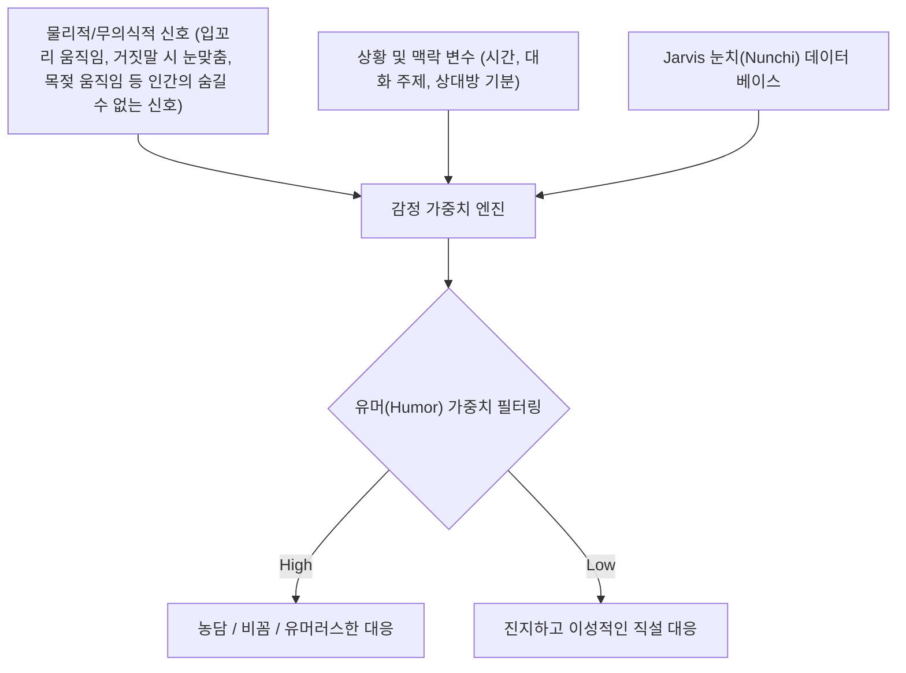

## 🎮 Project Overview

- **행사명**: 2026년 학과 자체 게임잼 (2026.06.29 ~ 2026.07.02)
- **주제**: 부패와 쇠퇴 (Decay and Decline)
- **플랫폼**: PC (Steam 타겟) / 2D 횡스크롤 어드벤처
- **역할**: 올라운더 (기획, AI 기반 노코드 개발, UI/UX 디자인, 최종 발표)
- **성과**: **개발 부문 만점** 획득
- **아쉬운 점**: 개발 제외 나머지 부분이 아쉬움

---

## 📖 Synopsis & Design Intent

### 1. 시놉시스

> 2126년 먼 미래, 태아 배양 단계에서 지능, 외모, 건강 등 부모가 원하는 최상의 유전 정보만을 선택하여 설계하는 기술이 보편화되었습니다. 정부는 국가 발전을 위해 모든 태아에게 유전 설계 시술을 의무화합니다.
>
> 그러나 주인공은 시술 과정의 부작용으로 남들과는 다른 개성과 불완전한 지능을 가지고 태어납니다. 모두가 표준화되고 완벽한 외모와 지능을 가진 사회에서, 주인공은 매 순간 '다름'으로 인한 불편함과 감시를 겪습니다. 20세가 되던 해, 그는 의문을 던집니다.
> _"남들과 다르다는 것이 왜 문제가 되는 거지? 우리만의 개성과 색깔이 왜 감시받아야 하는 걸까?"_
>
> 주인공은 사회의 의심을 피해 숨어 살지, 혹은 자신의 개성을 드러내며 사람들을 설득하고 공존하는 사회를 만들지 선택의 기로에 십니다.

### 2. 기획 의도

- **초기 기획 (Brain Rot)**: '부패와 쇠퇴'라는 주제를 현대 사회의 도파민 중독(릴스, 쇼츠) 및 AI 과의존으로 인한 인지 능력의 퇴화로 해석했습니다. AGI의 출현으로 농사조차 짓지 못하게 된 쇠퇴한 미래 바보 인류를 이끌어 나가는 스토리였습니다.
- **최종 기획 (획일화와 표준화)**: 팀원들과의 의견 공유를 거쳐, 한국 교육의 주입식 환경을 풍자하는 방향으로 변경했습니다. 모든 인류가 뛰어난 장점만을 취사선택하면서 개성이 말살되고 표준화된 사회 자체를 '사상적 부패와 발전 없는 현실적 쇠퇴'로 정의하고, 이 획일성에서 탈출하고 공존을 도모하는 어드벤처 게임으로 구체화했습니다.

---

## 💻 Tech Stack & Implementation

### AI 기반 노코드(No-Code) 협업 개발

개발진 부족(2학년 선배 1명과 본인)이라는 한계를 극복하기 위해, 하네스 엔지니어링을 활용한 **AI 코딩 어시스턴트와의 유기적인 노코드 개발 워크플로우**를 구축했습니다.

1. **상태 관리 및 시스템 구현**:
   - **의심도 게이지 시스템**: 표준화된 군중들 사이에서 튀는 행동을 할 때 증가하는 실시간 의심도 메커니즘 구현.
   - **스탯 기반 설득 시스템**: 캐릭터의 화술, 이동 속도, 매력 스탯에 따라 NPC들과의 대화 난이도 및 의심도 증가폭이 유기적으로 조절되는 시스템 설계.
   - **멀티 엔딩 구조**: 대화 및 은신 결과에 따라 플레이어가 숨어 살지, 혹은 세상을 바꾸는 개성의 상징이 될지 결정되는 스토리 분기 개발.
2. **UI/UX 디자인 및 폴리싱**:
   - 게임의 몰입감을 더해주는 어둡고 통제된 미래 도시 분위기의 UI 테마 적용.
   - 횡스크롤 뷰에 최적화된 충돌 판정 및 부드러운 스태틱 모션 구현.

AI와의 협업으로 짧은 타임라인 내에 프로토타입을 빌드업하여, 최종 심사에서 **개발성 부문 만점**을 기록했습니다. (인문학적 깊이에서 다소 아쉬운 피드백이 있었으나, 뼈 속까지 개발자라는 평을 들으며, 1학년인데 앞으로의 행보가 기대된다는 말을 듣고 마무리했습니다.)

---

## 🧠 Academic & Research Achievements

게임잼 현장에서는 개발 외에도 학술적으로 뜻깊은 학과 교수진과의 네트워킹과 공동 연구 제안이 성사되었습니다.

### 1. 박성준 교수님(학과장)과의 미팅: '유머(Humor) 가중치 알고리즘' 제안

게임잼 기간 중, 개발 현장을 방문하신 학과장 박성준 교수님께 현재 빌드 방식과 더불어 개인 연구인 **J.A.R.V.I.S. 프로젝트 및 하네스 엔지니어링(Harness Engineering)**과 고등학교 때 앱을 개발한다던가, 논문을 쓴다던가, 동아리 부원들을 가르친다던가 했던 과거 등을 설명했습니다.

로봇과 Physical AI 그리고 인간의 감정적 상호작용 연구를 구상 중이시던 교수님께, 기존 Jarvis의 핵심인 **눈치(Nunchi) 알고리즘**을 활용한 새로운 감정 상호작용 아이디어를 제안했습니다.

- **알고리즘 상세**: 인간의 상태, 기분, 대화 상황뿐만 아니라 **무의식적 물리 변수**(예: 거짓말할 때 일부러 눈을 마주치려는 반사 행동, 감정 변화에 따른 입꼬리 미세 변화, 목젖의 떨림 등)를 총합적으로 수집하여 `Humor` 가중치 필터를 거칩니다. 이 필터를 통해 에이전트가 상대방에게 진지하게 대답할지, 비꼬거나 농담을 던질지를 결정하는 알고리즘입니다.
- **성과**: 교수님께서 해당 인터랙션 알고리즘 설계에 큰 흥미를 보이셨으며, **추후 로봇-인간 상호작용 공동 연구에 정식 참여할 것을 제안**받았습니다.

### 2. 양혜지 교수님 연구실 조교 활동 및 사업 추천

- **논문 리서치 최적화**: 관심 있는 학술 논문 10개 요약 과제를 부여받았으나, 평소 AI 에이전트 및 강화학습 시스템 연구를 위해 아카이빙해 둔 **40개 이상의 해외 논문 리서치 내역**이 있기에, 게임잼에 집중할 수 있었습니다.
- **교내 사업 추천**: 해당 신뢰를 바탕으로 양혜지 교수님으로부터 교내 교육과정 개발 관련 사업에 공식 추천되었습니다.
