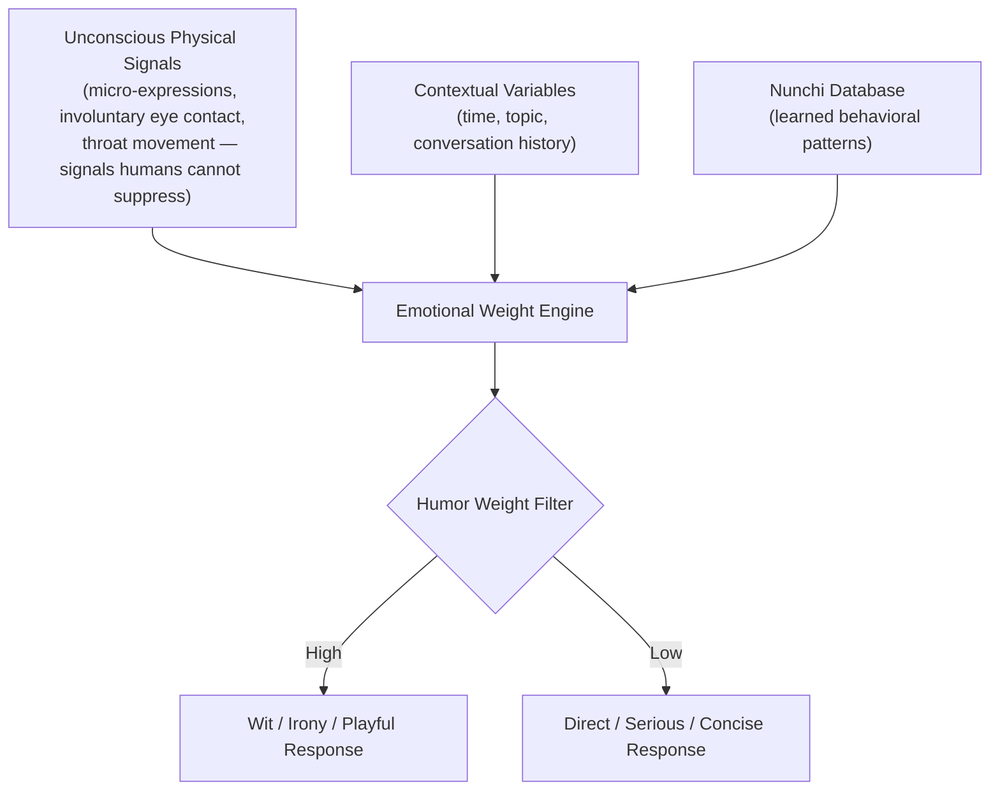

## 🎮 Project Overview

- **Event**: 2026 Department Game Jam (June 29 – July 2, 4 days)
- **Theme**: Decay and Decline (부패와 쇠퇴)
- **Platform**: PC (Steam target) / 2D side-scrolling adventure
- **Role**: All-rounder (concept, AI-assisted no-code development, UI/UX design, final presentation)
- **Result**: Highly positive feedback for development
- **Reflection**: Strong on the engineering side; room to grow in the humanities/narrative depth

---

## 📖 Synopsis & Design Intent

### Synopsis

> In the year 2126, genetic engineering at the embryonic stage has become universal — parents select optimal intelligence, appearance, and health for their children. The government mandates genetic design for all newborns in the name of national progress.
>
> But the protagonist is born different. A side effect of the procedure gives them an unoptimized mind and a distinct personality in a world where everyone is standardized and "perfect." Every day is spent navigating suspicion and surveillance for the crime of being different.
>
> At age 20, the protagonist asks: _"Why is being different a problem? Why should our individuality be policed?"_
>
> The player decides: hide and survive — or stand up, persuade others, and build a society where difference and coexistence are possible.

### Design Evolution

- **Initial concept (Brain Rot)**: Interpreted "decay and decline" as cognitive degradation from dopamine addiction (reels, shorts) and AI over-reliance. A story about leading a decayed future humanity after AGI makes even farming obsolete.
- **Final concept (Uniformity)**: After team discussion, pivoted to satirizing Korea's conformist education system. Redefined "decay" as the ideological rot of a society that eliminates individuality through standardization, and "decline" as the stagnation that follows when no one is different enough to innovate.

---

## 🏛️ 아키텍처 (Architecture)

게임 내러티브와 시스템은 획일화된 사회에서의 억압과 설득 과정을 시뮬레이션하도록 설계되었습니다.

1. **의심도 게이지 시스템 (Suspicion System)**: 규격화된 군중 속에서 튀는 행동을 할 때마다 실시간으로 의심도가 상승하여 감시망에 노출됩니다.
2. **스탯 기반 설득 시스템 (Stat-Based Persuasion)**: NPC와의 대화 난이도와 의심도 증가율이 플레이어의 수사학(Rhetoric), 이동 속도, 카리스마 스탯에 따라 동적으로 변합니다.
3. **멀티 엔딩 구조 (Multi-Ending)**: 플레이어의 선택(숨어서 생존할 것인가, 혹은 타인을 설득하여 다름을 인정하는 사회를 만들 것인가)에 따라 결말이 분기됩니다.

---

## 🛠️ 기술 스택 (Technical Stack)

**AI-Assisted No-Code Development (Harness Engineering Workflow)**
팀 내 개발 인력이 신입생인 저와 2학년 선배 단 두 명뿐인 상황에서, 시간과 인력의 한계를 극복하기 위해 **AI 어시스턴트를 적극 활용한 노코드(No-code) 및 프롬프트 주도 개발 파이프라인**을 도입했습니다.

- AI와의 협업(Tiki-Taka)을 통해 복잡한 충돌 감지 및 2D 횡스크롤 시스템을 단기간에 프로토타이핑했습니다.
- 기술적 구현력과 AI-assisted 워크플로우 접근 방식에 대해 심사위원들로부터 "만점"에 가까운 **매우 긍정적인 평가(Highly positive feedback)**를 받았습니다.

---

## ⚠️ 한계 (Limitations)

- **인문학적 깊이의 아쉬움**: 기술적 실행력(Engineering)과 시스템 구현에서는 뛰어난 성과를 거두었으나, 사회 비판적 메시지를 게임 내러티브로 자연스럽게 녹여내는 인문학적 깊이와 스토리텔링 측면에서는 보완이 필요하다는 피드백을 받았습니다. 이는 향후 기술에 인간과 사회를 잇는 통찰을 더해야 함을 깨닫는 계기가 되었습니다.

---

## 🚀 향후 연구 방향 (Future Research Directions)

게임잼 현장은 단순한 개발을 넘어, 향후 대학원 연구 방향의 싹을 틔우는 중요한 학술적 교류의 장이 되었습니다.

### 1. HRI(인간-로봇 상호작용)를 위한 Humor Weight Algorithm 고안

학과장님이신 박성준 교수님과의 디스커션 중, 기존의 J.A.R.V.I.S. 다중 에이전트 설계에 인간의 비언어적 신호를 결합하는 **Nunchi (눈치) 시스템** 아이디어를 발전시켜 제안했습니다.

거짓말을 할 때의 의도적인 시선 교환, 감정 변화 시 입꼬리의 미세 표정(Micro-expressions) 등 인간이 통제하기 힘든 **무의식적 물리 신호(Sub-linguistic layer)**를 종합하여 에이전트의 응답 톤(농담, 진지함 등)을 결정하는 이 알고리즘은, 교수님으로부터 HRI 적용 가능성에 대한 매우 고무적인 평가를 받았습니다.

### 2. 연구 및 교육 이니셔티브 확장

- 이후 양혜지 교수님 수업에서 10편의 논문 요약 과제를 넘어 **40여 편의 해외 AI/RL 논문을 자발적으로 아카이빙 및 분석**하는 적극성을 보였고, 그 결과 학과 교육과정 개편 이니셔티브 후보로 오르는 등 교육과 지식 공유 활동(TA)으로 연구의 지평을 넓혀가고 있습니다.
