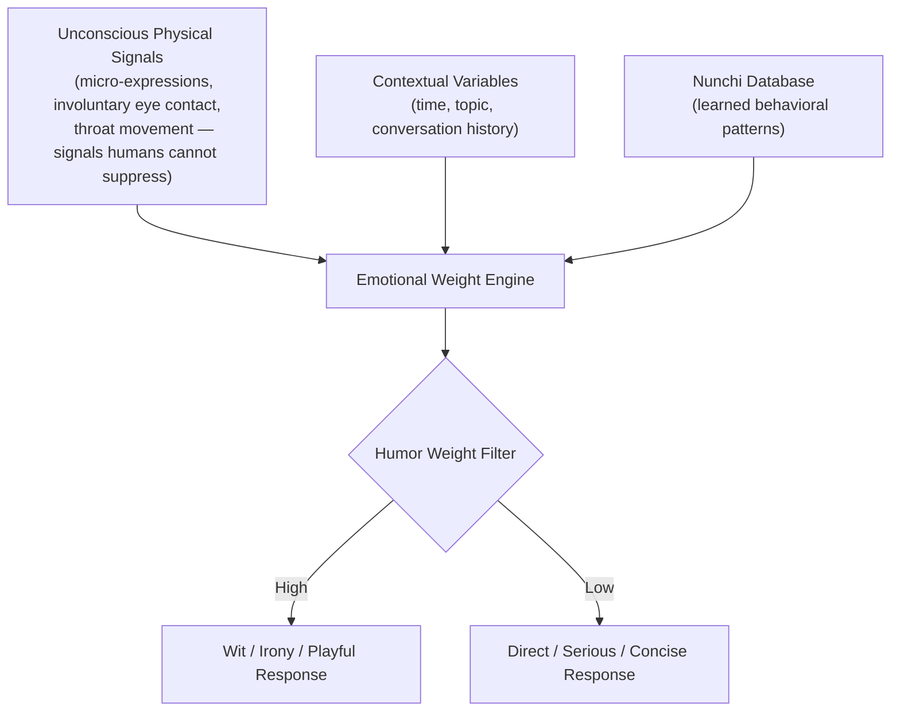

## 🎮 Project Overview

- **Event**: 2026 Department Game Jam (June 29 – July 2, 4 days)
- **Theme**: Decay and Decline (부패와 쇠퇴)
- **Platform**: PC (Steam target) / 2D side-scrolling adventure
- **Role**: All-rounder (concept, AI-assisted no-code development, UI/UX design, final presentation)
- **Result**: **Perfect score in development category**
- **Reflection**: Strong on the engineering side; room to grow in the humanities/narrative depth

---

## 📖 Synopsis & Design Intent

### Synopsis

> In the year 2126, genetic engineering at the embryonic stage has become universal — parents select optimal intelligence, appearance, and health for their children. The government mandates genetic design for all newborns in the name of national progress.
>
> But the protagonist is born different. A side effect of the procedure gives them an unoptimized mind and a distinct personality in a world where everyone is standardized and "perfect." Every day is spent navigating suspicion and surveillance for the crime of being different.
>
> At age 20, the protagonist asks: _"Why is being different a problem? Why should our individuality be policed?"_
>
> The player decides: hide and survive — or stand up, persuade others, and build a society where difference and coexistence are possible.

### Design Evolution

- **Initial concept (Brain Rot)**: Interpreted "decay and decline" as cognitive degradation from dopamine addiction (reels, shorts) and AI over-reliance. A story about leading a decayed future humanity after AGI makes even farming obsolete.
- **Final concept (Uniformity)**: After team discussion, pivoted to satirizing Korea's conformist education system. Redefined "decay" as the ideological rot of a society that eliminates individuality through standardization, and "decline" as the stagnation that follows when no one is different enough to innovate.

---

## 💻 Tech Stack & Implementation

### AI-Assisted No-Code Development

With only two developers on the team (a sophomore and myself as a freshman), I adopted a **Harness Engineering workflow** — an organic no-code development process using AI coding assistants to overcome the staffing constraint.

#### Core Systems Built

1. **Suspicion Gauge System**: A real-time meter that increases when the player exhibits behavior that stands out in the standardized crowd.

2. **Stat-Based Persuasion System**: NPC conversation difficulty and suspicion increase rates dynamically adjust based on the player character's rhetoric, movement speed, and charisma stats.

3. **Multi-Ending Structure**: Story branches based on dialogue choices and stealth outcomes — the player can choose to hide and survive, or become a symbol of individuality that changes the world.

#### UI/UX Polish

- Dark, controlled future-city aesthetic to reinforce the oppressive atmosphere
- Collision detection and smooth static motion optimized for side-scrolling view

The AI collaboration allowed us to build a prototype within the tight timeline, earning a **perfect score in the development category**. Judges noted areas for deeper humanities exploration, but called me a "developer to the bone" and said they were excited to see where I'd go from here — especially as a freshman.

---

## 🧠 Academic & Research Achievements

Beyond the game itself, the jam produced meaningful academic connections:

### 1. Prof. Seong-jun Park (Department Head) — Humor Weight Algorithm Proposal

During the event, I explained my **J.A.R.V.I.S. project and Harness Engineering** workflow to Prof. Park, who was visiting the development floor. I also shared my high school background — building apps, writing research papers, teaching club members.

Prof. Park, who was exploring human-robot emotional interaction research, was interested in a new interaction concept I proposed based on J.A.R.V.I.S.'s **Nunchi (눈치) algorithm**:

The algorithm aggregates not just words and context, but **unconscious physical signals** — such as the reflex to make deliberate eye contact when lying, micro-expressions at the corners of the mouth during emotional shifts, or throat tremors — and routes them through a `Humor` weight filter to determine whether the agent should respond seriously, sarcastically, or playfully.

**Result**: Prof. Park proposed a formal research collaboration on this interaction model for human-robot systems.

### 2. Prof. Hyeji Yang — TA Role & Curriculum Development

- When assigned to summarize 10 research papers, I already had an archive of **40+ international papers** from my independent AI agent and RL research — allowing me to focus on the game jam.
- Based on this demonstrated initiative, Prof. Yang officially recommended me for the university's **curriculum development initiative**.
