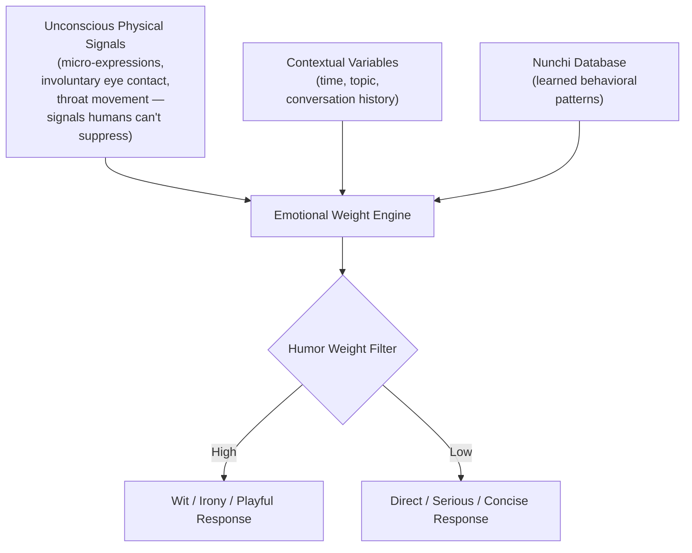

## 🧠 What Is J.A.R.V.I.S.?

J.A.R.V.I.S. (Just A Rather Very Intelligent System) is my flagship independent research project — a **conceptual architecture and prototype** for a multi-agent orchestration system designed to go beyond chatbots and act as a genuine autonomous engineering collaborator.

The core thesis: most AI assistants are reactive. J.A.R.V.I.S. is designed to be **proactive, self-correcting, and socially aware** — capable of understanding not just what you say, but what you mean, what you feel, and what you haven't said yet.

---

## 🏛️ Architecture: Harness Engineering

The execution model I call **Harness Engineering** is a closed-loop multi-agent sprint pipeline:

```
[User Goal]
    ↓
[Harley PM — Roadmap & Definition of Done]
    ↓ (DoD Approval Gate)
Loop:
  [Friday — Code Generation]
      ↓
  [Docker Sandbox — Isolated Execution]
      ↓
  [Edith QA — Audit & Verdict]
      ↓ (PASS → Ship | FAIL → Friday retries with Edith's critique)
    ↓
[Final User Approval]
```

### Agent Roles

| Agent                  | Role                                                | Model         |
| ---------------------- | --------------------------------------------------- | ------------- |
| **Harley (PM)**        | Task decomposition, PRD, Definition of Done         | Llama 4 Scout |
| **Friday (Generator)** | Code implementation, iteration                      | Llama 4 Scout |
| **Edith (QA Auditor)** | Adversarial critique, security, correctness verdict | GPT-OSS 120B  |

### Key Engineering Decisions

- **Tiki-Taka Loop**: Friday and Edith engage in direct back-and-forth — Friday writes, Edith critiques with a `Verdict: PASS/FAIL`, Friday revises. No human bottleneck in the correction cycle.
- **Infinite Loop Freeze Gateway**: If the same error signature repeats 6+ times, the system serializes state to `sprint_state_{thread_id}.json`, pauses, and surfaces a structured intervention request. The system never spins silently.
- **Docker Sandbox Execution**: All code runs in an isolated, network-disabled container (`python:3.11-slim`, 128MB RAM cap, 0.5 CPU). Fallback to subprocess with static library blacklisting.
- **MCTS Planning Layer**: Complex tasks route through Monte Carlo Tree Search for path planning before any execution begins — decompose → deliberate → search → verify.

---

## 👁️ Nunchi (눈치) Algorithm — Reading the Room

The differentiating layer of J.A.R.V.I.S. is the **Nunchi engine**: a social context modeling system named after the Korean concept of reading the atmosphere between the lines.

Most AI systems respond to _what you say_. The Nunchi engine is designed to respond to _what the situation means_.

### Implicit Feedback Loop (Unsupervised)

The system infers context without requiring explicit user feedback:

```
User ignores joke → resumes work command immediately
  → JARVIS logs: social_battery LOW, humor_weight ↓

User sends message at 23:00 in short, dry sentences
  → JARVIS infers: proactive_weight ↓, response_mode = concise_report
```

No "rate this response" prompts. No manual tuning. The system reads patterns.

### Humor Weight Algorithm (Proposed Research Direction)

During the 2026 Department Game Jam, I proposed an extension of the Nunchi system to **Prof. Seong-jun Park (Department Head)**, who is researching human-robot emotional interaction:



The insight: humans don't just respond to words — they respond to the _sub-linguistic layer_. When someone lies, they often make deliberate eye contact. When someone suppresses an emotion, a micro-expression escapes at the corners of the mouth. An AI that can read this layer communicates at a fundamentally different depth.

I shared this concept with Prof. Park during the Game Jam, resulting in an encouraging discussion regarding its potential application to human-robot interaction.

---

## 🛠️ Technical Stack & Components

| Component              | Technology                                                 |
| ---------------------- | ---------------------------------------------------------- |
| Orchestration Runtime  | Node.js (TypeScript) + Jarvis CLI                          |
| Agent Communication    | Oh-My-ClaudeCode (OMC) pipeline                            |
| Code Execution Sandbox | Docker (`python:3.11-slim`)                                |
| Memory System          | Autonomous long-term memory via structured note management |
| Planning Layer         | MCTS (Monte Carlo Tree Search)                             |
| UI Prototyping         | Figma → HTML/CSS Rainmeter skin                            |

### 🚧 Planned Hardware Infrastructure

- **Hardware**: AMD Ryzen 7 7600 + RTX 4060Ti 16GB ×2 (currently in assembly)

---

## 📌 Design Philosophy

> _"Discipline equals freedom. We do not guess; we test, we verify, and we execute."_

J.A.R.V.I.S. is not a product. It's a research platform for exploring what it means to build an AI that genuinely understands human context — one that earns trust not by being agreeable, but by being correct.

The long-term goal is not a smarter autocomplete. It's a system that knows when to joke, when to push back, when to be silent, and when to act without being asked.
